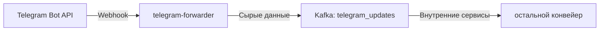
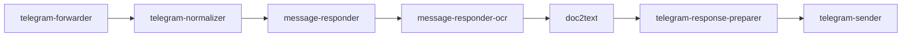

## О приложении

telegram-forwarder — лёгкий HTTP‑шлюз, который принимает webhook‑запросы от Telegram Bot API и без изменений отправляет их в Kafka. Сервис не парсит апдейты и не проверяет подписи: он лишь надёжно доставляет тело запроса в конвейер.

## Роль приложения в архитектуре проекта

Компонент открывает входную точку Telegram‑ветки:


Благодаря ему остальные сервисы не работают с публичным интернетом и могут читать события из Kafka в удобном формате. Также forwarder предоставляет `/healthz`, чтобы оркестратор понимал готовность узла.

## Локальный запуск

1. Убедитесь, что Go ≥ 1.24 установлен и есть доступ к Kafka‑кластеру. Для отладки webhook можно использовать `ngrok` или локальный reverse proxy, который прокинет запросы Telegram на ваш порт.
2. Экспортируйте переменные окружения:
   - `SERVER_ADDR_TELEGRAM_FORWARDER` — адрес HTTP‑сервера (например, `:8080`).
   - `KAFKA_BOOTSTRAP_SERVERS_VALUE` — список брокеров.
   - `KAFKA_TOPIC_NAME_TELEGRAM_UPDATES` — имя Kafka‑топика с сырыми апдейтами.
   - `KAFKA_SASL_USERNAME` и `KAFKA_SASL_PASSWORD` — заполните, если Kafka требует SASL/PLAIN.
   - `TELEGRAM_TOKEN` — токен бота (forwarder хранит его, чтобы, например, проверять секрет при необходимости).
3. Запустите сервис:
   ```bash
   go run ./cmd/tgforwarder
   ```
   либо соберите контейнер `docker build -t telegram-forwarder .`.
4. Настройте Telegram webhook `https://<ваш-домен>/webhook` и убедитесь, что сообщения появляются в `KAFKA_TOPIC_NAME_TELEGRAM_UPDATES`. Готовность проверяется запросом `GET /healthz`.
